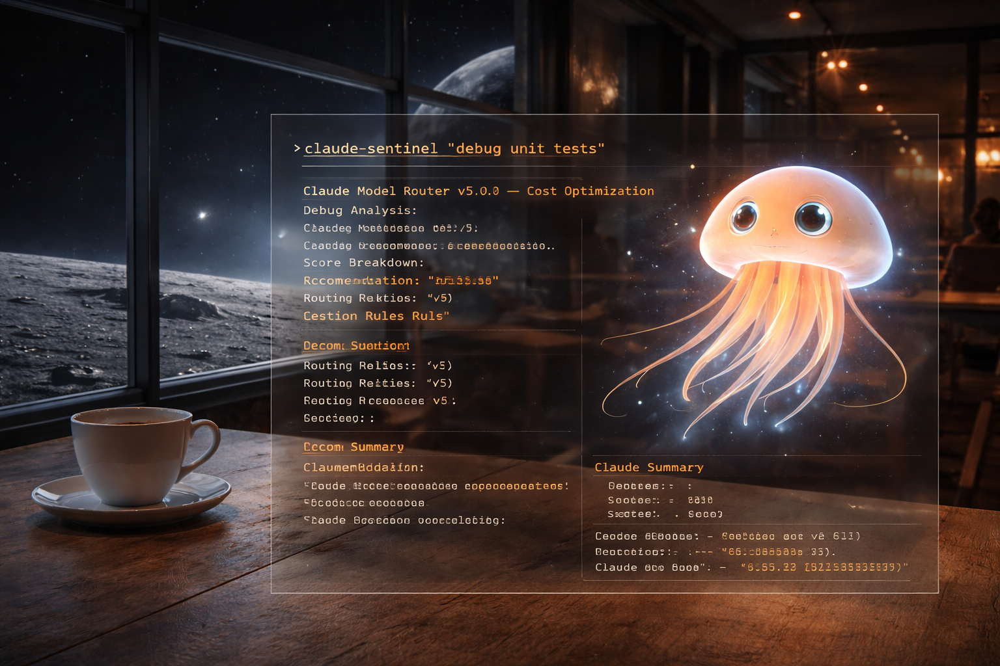

# Claude Sentinel v7.0

<p align="center">
  
</p>

<p align="center">
  <strong>The full Claude Code discipline layer + PETRA review pipeline.</strong><br>
  Model routing, PETRA multi-agent code review, KAIROS pattern learning, 18 HIPAA Safe Harbor PHI scanning, SOC 2 compliance, git hygiene, cost tracking, and enterprise developer onboarding — installed with one command.
</p>

<p align="center">
  <a href="#install">Install</a> &bull;
  <a href="#petra">PETRA</a> &bull;
  <a href="#model-routing">Routing</a> &bull;
  <a href="#soc-2-compliance">SOC 2</a> &bull;
  <a href="#git-hygiene">Git Hygiene</a> &bull;
  <a href="#cost-tracking">Cost Tracking</a> &bull;
  <a href="#architecture">Architecture</a>
</p>

---

## Architecture

```mermaid
%%{init: {'theme': 'dark', 'themeVariables': {'primaryColor': '#2d1b69', 'primaryTextColor': '#e0d4ff', 'primaryBorderColor': '#b14eff', 'lineColor': '#00e5ff', 'secondaryColor': '#0a1628', 'tertiaryColor': '#1a0a3e', 'fontFamily': 'monospace'}}}%%

flowchart TB
    subgraph org ["🏢 LifeMD Engineering"]
        direction LR
        E1["Engineer A<br/><i>ai-relay</i>"]
        E2["Engineer B<br/><i>billing</i>"]
        E3["Engineer C<br/><i>frontend</i>"]
    end

    subgraph sentinel ["🏛 CLAUDE SENTINEL v7.0"]
        direction TB

        subgraph hooks ["⚙ 4 Lifecycle Hooks"]
            direction LR
            H1["UserPromptSubmit<br/><i>model routing<br/>PHI scan · budget</i>"]
            H2["PreToolUse<br/><i>git hygiene<br/>PHI/secret block</i>"]
            H3["PostToolUse<br/><i>TDD nudge<br/>subagent tracking</i>"]
            H4["Stop<br/><i>session summary<br/>savings report</i>"]
        end

        subgraph petra ["✦ PETRA — Review Pipeline"]
            direction TB

            subgraph agents ["⚔ 5 Parallel Agents"]
                direction LR
                A1["🔍 petra-code<br/><i>bugs · logic<br/>conventions</i>"]
                A2["🧹 petra-simplify<br/><i>duplication<br/>dead code</i>"]
                A3["🛡 petra-security<br/><i>18 HIPAA IDs<br/>injection · auth</i>"]
                A4["📜 petra-history<br/><i>blame · churn<br/>past feedback</i>"]
                A5["⚡ codex gpt-5.4<br/><i>edge cases<br/>fragility</i>"]
            end

            subgraph modes ["📋 3 Modes"]
                direction LR
                M1["<b>/petra 96</b><br/>fresh review"]
                M2["<b>--re-review</b><br/>FIXED / NOT FIXED"]
                M3["<b>--self</b><br/>pre-push gate"]
            end

            subgraph kairos ["♻ KAIROS"]
                K1["<b>/petra-rebuild</b><br/><i>pattern extraction<br/>auto every 5 reviews</i>"]
                K2["REVIEW.md<br/><i>learned patterns</i>"]
            end
        end

        subgraph soc2 ["🔒 SOC 2 Compliance"]
            direction LR
            S1["PHI Scanner<br/><i>18 HIPAA IDs<br/>warn or block</i>"]
            S2["Secret Scanner<br/><i>AWS · GitHub · JWT<br/>warn or block</i>"]
            S3["Prompt Audit<br/><i>SHA-256 trail</i>"]
            S4["Log Scrubbing<br/><i>hash commands<br/>redact tokens</i>"]
        end

        subgraph git ["📝 Git Hygiene"]
            direction LR
            G1["prepare-commit-msg<br/><i>strip AI trailers</i>"]
            G2["commit-msg<br/><i>conventional commits</i>"]
            G3["pre-push<br/><i>PR size gating</i>"]
        end

        subgraph cost ["💰 Cost Optimization"]
            direction LR
            C1["Model Router<br/><i>haiku · sonnet · opus<br/>7-factor scoring</i>"]
            C2["Budget Alerts<br/><i>daily · weekly limits</i>"]
            C3["Session Depth<br/><i>compaction advisor</i>"]
        end
    end

    subgraph output ["📤 Outputs"]
        direction LR
        O1["GitHub PR<br/>comments"]
        O2["cost_log.csv"]
        O3["phi_detections.log"]
        O4["prompt_audit.log"]
        O5["session_summary.log"]
    end

    E1 & E2 & E3 --> sentinel
    hooks --> output
    A1 & A2 & A3 & A4 & A5 --> O1
    K1 -.->|"rebuilds"| K2
    K2 -.->|"feeds reviews"| agents
    S1 -.->|"shared config"| A3

    style org fill:#0a1628,stroke:#00e5ff,color:#e0d4ff,stroke-width:2px
    style sentinel fill:#0d0221,stroke:#b14eff,color:#e0d4ff,stroke-width:3px
    style hooks fill:#2d1b69,stroke:#b14eff,color:#e0d4ff,stroke-width:2px
    style petra fill:#1a0a3e,stroke:#ff6ec7,color:#e0d4ff,stroke-width:2px
    style agents fill:#0f2847,stroke:#00e5ff,color:#e0d4ff,stroke-width:2px
    style modes fill:#2d1b69,stroke:#b14eff,color:#e0d4ff,stroke-width:1px
    style kairos fill:#1a0a3e,stroke:#ff6ec7,color:#e0d4ff,stroke-width:2px,stroke-dasharray: 5 5
    style soc2 fill:#2d1b69,stroke:#ff6ec7,color:#e0d4ff,stroke-width:2px
    style git fill:#0f2847,stroke:#00e5ff,color:#e0d4ff,stroke-width:2px
    style cost fill:#0f2847,stroke:#00e5ff,color:#e0d4ff,stroke-width:2px
    style output fill:#0a1628,stroke:#00e5ff,color:#e0d4ff,stroke-width:2px

    style E1 fill:#0f2847,stroke:#00e5ff,color:#e0d4ff
    style E2 fill:#0f2847,stroke:#00e5ff,color:#e0d4ff
    style E3 fill:#0f2847,stroke:#00e5ff,color:#e0d4ff
    style H1 fill:#3d2080,stroke:#b14eff,color:#e0d4ff
    style H2 fill:#3d2080,stroke:#b14eff,color:#e0d4ff
    style H3 fill:#3d2080,stroke:#b14eff,color:#e0d4ff
    style H4 fill:#3d2080,stroke:#b14eff,color:#e0d4ff
    style A1 fill:#0f2847,stroke:#00e5ff,color:#e0d4ff
    style A2 fill:#0f2847,stroke:#00e5ff,color:#e0d4ff
    style A3 fill:#0f2847,stroke:#00e5ff,color:#e0d4ff
    style A4 fill:#0f2847,stroke:#00e5ff,color:#e0d4ff
    style A5 fill:#0f2847,stroke:#00e5ff,color:#e0d4ff
    style M1 fill:#3d2080,stroke:#b14eff,color:#e0d4ff
    style M2 fill:#3d2080,stroke:#b14eff,color:#e0d4ff
    style M3 fill:#3d2080,stroke:#b14eff,color:#e0d4ff
    style K1 fill:#1a0a3e,stroke:#ff6ec7,color:#e0d4ff
    style K2 fill:#1a0a3e,stroke:#ff6ec7,color:#e0d4ff
    style S1 fill:#3d2080,stroke:#ff6ec7,color:#e0d4ff
    style S2 fill:#3d2080,stroke:#ff6ec7,color:#e0d4ff
    style S3 fill:#3d2080,stroke:#ff6ec7,color:#e0d4ff
    style S4 fill:#3d2080,stroke:#ff6ec7,color:#e0d4ff
    style G1 fill:#0f2847,stroke:#00e5ff,color:#e0d4ff
    style G2 fill:#0f2847,stroke:#00e5ff,color:#e0d4ff
    style G3 fill:#0f2847,stroke:#00e5ff,color:#e0d4ff
    style C1 fill:#0f2847,stroke:#00e5ff,color:#e0d4ff
    style C2 fill:#0f2847,stroke:#00e5ff,color:#e0d4ff
    style C3 fill:#0f2847,stroke:#00e5ff,color:#e0d4ff
    style O1 fill:#0a1628,stroke:#00e5ff,color:#e0d4ff
    style O2 fill:#0a1628,stroke:#00e5ff,color:#e0d4ff
    style O3 fill:#0a1628,stroke:#00e5ff,color:#e0d4ff
    style O4 fill:#0a1628,stroke:#00e5ff,color:#e0d4ff
    style O5 fill:#0a1628,stroke:#00e5ff,color:#e0d4ff
```



---

## Install

```bash
git clone https://github.com/christinacephus-md/claude-sentinel.git
cd claude-sentinel

# Full install (routing + hooks + git hooks + PETRA)
./install.sh --all

# Core only (routing + hooks)
./install.sh --force

# Update existing install (preserves config)
./install.sh --update --force
```

After install, you get:

| Command | What It Does |
|---|---|
| `/petra <PR#>` | 5-agent parallel PR review, consolidate, post to GitHub |
| `/petra <PR#> --re-review` | Track FIXED / NOT FIXED per finding |
| `/petra --self` | Review uncommitted changes before pushing |
| `/petra-rebuild` | KAIROS: regenerate REVIEW.md from PR history |
| `/budget-check` | Check spending against daily/weekly limits |

---

## PETRA

**P**attern-**E**xtracted **T**esting & **R**eview **A**gent — a 5-agent parallel code review pipeline that learns from historical review patterns.

### Agents

| Agent | Focus |
|---|---|
| **petra-code** | Bugs, logic errors, convention violations, CLAUDE.md compliance |
| **petra-simplify** | Duplication, dead code, unnecessary complexity |
| **petra-security** | 18 HIPAA Safe Harbor identifiers, injection, auth, infra |
| **petra-history** | Git blame (pre-existing vs new), file churn, previous PR feedback |
| **codex** (gpt-5.4) | Edge-case correctness, runtime fragility |

### Modes

**Fresh review** — `/petra 96`
- Fetches PR diff, loads REVIEW.md patterns, dispatches 5 agents in parallel
- Consolidates, deduplicates, verifies via git blame
- Posts to GitHub with security audit table + severity-sorted findings

**Re-review** — `/petra 96 --re-review`
- Finds previous PETRA comment, extracts each finding
- Gets commits since that review (anchored on `headRefOid` SHA)
- Reports FIXED / NOT FIXED / PARTIALLY FIXED per finding
- Runs agents only on the inter-diff for new findings

**Self-review** — `/petra --self`
- Reviews your uncommitted/staged changes before pushing
- Console-only output, advisory tone
- No PR needed — works on any branch with local changes

### KAIROS Pattern Learning

Every review comment posted to GitHub IS the learning event. `/petra-rebuild` mines all historical comments and regenerates REVIEW.md:
- Developer patterns (2+ occurrence threshold, keyed by GitHub handle)
- Area patterns (grouped by directory)
- Finding type frequency
- Codex-unique findings

**Auto-trigger:** `~/.claude/petra-review-count.json` tracks reviews. Every 5 reviews or 2 days, KAIROS runs automatically.

### Battle-Tested

| PR | Target | Blockers | Medium | Low/Nit |
|---|---|---|---|---|
| #97 | Knowledge docs | 2 | 9 | 4 |
| #101 | Review pipeline | 3 | 9 | 4 |
| #90 | CI workflow + Codex | 3 | 5 | 6 |
| Sentinel v7 | Self-review | 8 | 13 | 12 |

---

## Model Routing

Every prompt scored across 7 factors. Short follow-ups auto-route to Haiku. Debugging and code review enforce a Sonnet floor.

```
+---------------------------------------------------------+
|  Sentinel v7.0 - Cost Optimization + SOC 2           |
+---------------------------------------------------------+

  Analysis:
    Keywords: Simple=0 Complex=0 Downgrade=5
    Debug=5 Review=0
    Tool Complexity: LOW
    File Context: no_files
    Inference Depth: SHALLOW
    Conversation: FRESH
    Score: 1

  Recommendation: /model sonnet
    Reason: Debug task (Sonnet floor)
```

| Tier | Keywords | Effect |
|------|----------|--------|
| Debug | error, bug, stack trace, crash, race condition (28 keywords) | Sonnet floor |
| Review | review, PR, diff, critique (15 keywords) | Sonnet floor; large reviews → Opus |
| Complex | architect, design system, deep dive | Push toward Opus |
| Simple | show me, what is, list | Push toward Haiku |
| Downgrade | just, quickly, trivial | Push cheaper |

---

## SOC 2 Compliance

### PHI Scanner (18 HIPAA Safe Harbor Identifiers)

All patterns loaded from `config/phi_patterns.json` — single source of truth shared by sentinel.py, pre_tool_use.sh, and petra-security.

| # | Identifier | Pattern |
|---|---|---|
| 1 | Names (patient context) | `patient/pt + medical verb` |
| 2 | Geographic data | ZIP codes |
| 3 | Dates | DOB, admission, discharge, death |
| 4 | Phone numbers | US format |
| 5 | Fax numbers | Keyword + phone format |
| 6 | Email addresses | Standard email |
| 7 | SSN | Excludes 000/666/900-999 |
| 8 | MRN | Medical record numbers |
| 9 | Health plan IDs | Beneficiary/member/policy numbers |
| 10 | Account numbers | 8-12 digit account refs |
| 11 | License/cert numbers | DEA, NPI, medical license |
| 12 | Vehicle identifiers | VIN (17-char) |
| 13 | Device identifiers | UDI, serial numbers |
| 14 | Web URLs | Patient portal links |
| 15 | IP addresses | IPv4 |
| 16 | Biometric identifiers | Fingerprint, voiceprint, retina |
| 17 | Photos | Patient photo filenames |
| 18 | Unique IDs | patient_id, subscriber_id, member_id |

**Enforcement modes** (`sentinel_config.json`):
- `"warn"` — log detection, print warning (default)
- `"block"` — emit `{"decision":"block"}` + exit code 2, Claude Code refuses the tool call

### Prompt Audit Trail
SHA-256 hash of every prompt logged to `prompt_audit.log`. Never stores raw content.

### Secret Scanner
AWS keys (AKIA), GitHub tokens/PATs, Bearer tokens, generic secrets, private keys. Same warn/block enforcement modes.

### Log Scrubbing
- Bash commands: only command name + SHA-256 hash logged (never arguments)
- Git push: tokens redacted from URLs
- Subagent descriptions: scrubbed (may contain PHI from user prompts)

---

## Git Hygiene

**prepare-commit-msg** — strips AI trailers before the editor opens
**commit-msg** — conventional commit enforcement (`feat|fix|chore|docs|...`)
**pre-push** — PR size gating (warn at 500, block at 2000 lines) + AI trailer scan

```bash
# Global install
git config --global core.hooksPath ~/.claude/plugins/sentinel/git-hooks

# Per-repo
ln -sf ~/.claude/plugins/sentinel/hooks/commit-msg .git/hooks/commit-msg
```

---

## Cost Tracking

Budget alerts at 80% of daily/weekly limits. Configure in `config/budget.json`.

Native `/cost` (Claude Code April 2026) now handles per-model breakdown. Sentinel adds:
- Historical trends (weekly/monthly)
- Per-project attribution
- Savings vs all-Opus baseline
- Session depth tracking with compaction advisor

---

## Project-Specific Patterns

Drop `.claude/router-patterns.json` in any project:
```json
{
  "haiku_keywords": ["lookup patient", "check appointment"],
  "opus_keywords": ["hipaa", "phi audit", "compliance review"]
}
```

---

## Structure

```
claude-sentinel/
├── install.sh                          # One-command install
├── uninstall.sh                        # Clean removal
├── test_hook.sh                        # Test suite
├── plugin/
│   ├── plugin.json                     # v7.0.0 manifest
│   ├── hooks/
│   │   ├── hooks.json                  # Hook registration (all 4 hooks)
│   │   ├── sentinel.py                 # 7-factor router + PHI scan + budget
│   │   ├── cost_report.py              # Cost report generator
│   │   ├── pre_tool_use.sh             # Git hygiene + PHI/secret block
│   │   ├── pre_tool_use_write.sh       # Write/Edit secret scan
│   │   ├── post_tool_use.sh            # TDD nudge + subagent tracking
│   │   └── stop_hook.sh               # Session summary
│   └── config/
│       ├── phi_patterns.json           # 18 HIPAA identifiers (single source)
│       ├── patterns.json               # Routing keywords
│       ├── budget.json                 # Spend limits
│       ├── sentinel_config.json        # Feature toggles + enforcement modes
│       └── review-patterns-seed.md     # Starter REVIEW.md template
├── agents/
│   ├── router-advisor.md               # Model selection agent
│   ├── petra-code.md                   # PETRA: code review
│   ├── petra-simplify.md               # PETRA: simplification
│   ├── petra-security.md               # PETRA: security (18 HIPAA)
│   └── petra-history.md                # PETRA: git blame + churn
├── commands/
│   ├── petra.md                        # /petra — 5-agent review
│   ├── petra-rebuild.md                # /petra-rebuild — KAIROS
│   ├── budget-check.md                 # /budget-check
│   └── cost-report.md                  # /cost-report (deprecated)
├── git-hooks/
│   ├── prepare-commit-msg
│   ├── commit-msg
│   └── pre-push
├── docs/
│   ├── ACCESS.md                       # SDLC-12: Role matrix
│   ├── ISSUES.md                       # SDLC-10: Issues register
│   └── reviews/                        # PETRA review artifacts
└── examples/
    ├── custom_patterns.json
    └── healthcare_patterns.json
```

---

## ITGC-SDLC Compliance

| Control | Name | Document |
|---------|------|----------|
| SDLC-1 | Overview / Specs | `README.md`, `plugin.json` |
| SDLC-2 | Pre-Dev Approval | `CONTRIBUTING.md` |
| SDLC-3 | Project Governance | `README.md`, git log |
| SDLC-4 | System Changes | `commit-msg` hook, `cost_log.csv` |
| SDLC-5 | IT Testing | `test_hook.sh` |
| SDLC-6 | User Acceptance Testing | `VALIDATION.md` |
| SDLC-7 | Data Conversion | `install.sh --update` |
| SDLC-8 | Reports | `cost_report.py`, `stop_hook.sh` |
| SDLC-9 | Interfaces | `plugin.json`, `hooks.json` |
| SDLC-10 | Issues Log | `docs/ISSUES.md` |
| SDLC-11 | Pre-Migration Approval | `pre-push` hook |
| SDLC-12 | Access Security | `docs/ACCESS.md` |

---

## Version History

- **v7.0.0** — PETRA review pipeline (5 agents + Codex), re-review mode, self-review mode, KAIROS auto-rebuild, 18 HIPAA Safe Harbor PHI patterns (single source of truth), PHI/secret blocking mode (exit code 2), all 4 hooks registered, session ID consistency, log scrubbing, deprecated /cost-report
- **v6.0.0** — SOC 2 compliance layer: PHI scanner, prompt audit trail, secret scanner, sensitive file detection
- **v5.0.0** — Debug/review routing tiers, subagent tracking, TDD nudge, PR size gating, smart compaction
- **v4.0.1** — Fix pre-push scope on new branches
- **v4.0.0** — Tiered keyword weights, downgrade signals, session depth tracking
- **v3.1.0** — Token-weighted cost estimates
- **v3.0.0** — Git hygiene, PreToolUse/PostToolUse/Stop hooks, conventional commits
- **v2.0.0** — Cost tracking, budget alerts, agents, commands
- **v1.0.0** — Multi-factor keyword routing

## Author

Christina Cephus

## License

MIT
