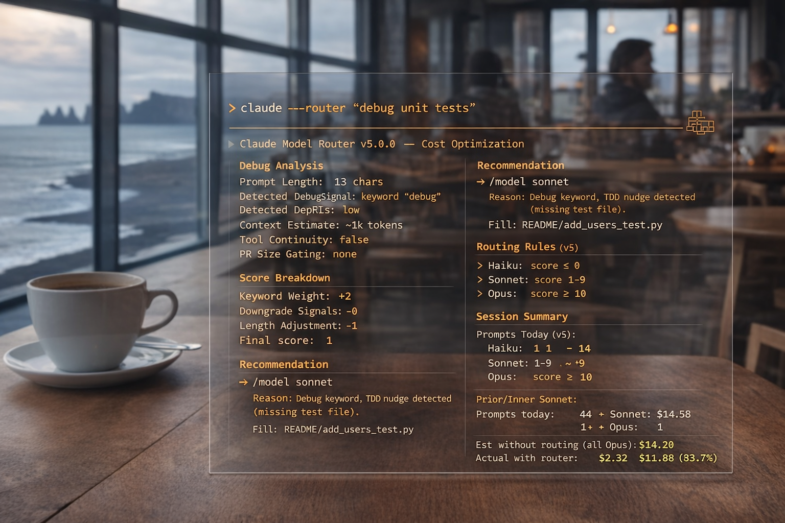

# Claude Model Router v5.0

<p align="center">
  
</p>

<p align="center">
  <strong>The full Claude Code discipline layer.</strong><br>
  Model routing, git hygiene enforcement, commit quality gates, session telemetry, subagent cost tracking, TDD nudges, PR size gating, and smart compaction — installed with one command.
</p>

<p align="center">
  <a href="#install">Install</a> &bull;
  <a href="#what-you-get">Features</a> &bull;
  <a href="#git-hygiene">Git Hygiene</a> &bull;
  <a href="#claude-code-hooks">Hooks</a> &bull;
  <a href="#cost-tracking">Cost Tracking</a>
</p>

---

## The Problem

1. Running Opus for "yes" and "looks good" burns 60x more than Haiku
2. Debugging tasks on Haiku waste time — too weak to reason about errors
3. Long conversations silently rack up cache write costs ($2-4/prompt on Opus at 100K+ context)
4. Claude Code injects `Co-Authored-By` and `Generated with Claude Code` into your git history
5. No visibility into where tokens are going across projects
6. Subagent spawns are the hidden cost killer — no tracking or warnings
7. No guardrails on PR size, commit quality, or test coverage
8. No session-level telemetry for async team handoffs

## The Fix

v5 covers all eight. Model routing uses tiered keyword weights, debug/review-aware routing, and downgrade signals to aggressively route simple tasks to Haiku while enforcing Sonnet minimums for debugging and code review. Git hooks strip AI trailers and gate PR size. PostToolUse tracks subagent spawns and nudges TDD. Smart compaction tells you *why* your context is bloated — not just that it is. All of it stacks with `/fast` mode.

---

## Install

```bash
git clone https://github.com/christinacephus-md/claude-model-router.git
cd claude-model-router

# Core install (routing + Claude Code hooks)
./install.sh --force

# Full install (add git hooks too)
./install.sh --all

# Update existing install (preserves your config)
./install.sh --update --force
```

---

## What You Get

### 1. Model Routing (UserPromptSubmit)

Every prompt scored across 7 factors with tiered keyword weights, word boundary matching, debug/review awareness, and downgrade signal detection. Short follow-ups auto-route to Haiku. Debugging and code review prompts enforce a Sonnet floor.

```
+---------------------------------------------------------+
|  Model Router v5.0 - Cost Optimization                  |
+---------------------------------------------------------+

  Analysis:
    Keywords: Simple=0 Complex=0 Downgrade=5
    Debug=5 Review=0
    Tool Complexity: LOW
    File Context: no_files
    Inference Depth: SHALLOW
    Conversation: FRESH
    Score: 1

  Recommendation: /model sonnet
    Reason: Debug task (Sonnet floor)

  Cost (per 1M input tokens):
    Haiku:  $0.25   Sonnet: $3.00   Opus: $15.00

  Today: 23 prompts | H:16 S:5 O:2 | Est: $1.12
  Saved vs all-Opus: $4.38
  Session: 8 prompts (~40K context)
```

**v5.0 routing tiers:**

| Tier | Keywords | Effect |
|------|----------|--------|
| Debug | error, bug, stack trace, crash, race condition, etc. (28 keywords) | Sonnet floor — debugging never routes to Haiku |
| Review | review, PR, diff, critique, etc. (15 keywords) | Sonnet floor; large multi-file reviews → Opus |
| Complex | architect, design system, deep dive, etc. | Push toward Opus |
| Simple | show me, what is, list, etc. | Push toward Haiku |
| Downgrade | just, quickly, trivial, etc. | Push toward cheaper models |

At deeper sessions, cache cost alerts and smart compaction recommendations appear:

```
  WARNING: Session depth: 25 prompts (~125K context)
    Cache write/prompt: Opus=$2.34  Sonnet=$0.47
    -> Cache costs growing — try /compact or start fresh

  COMPACT [HIGH]: 5 subagent spawns inflating context
    -> /compact — subagent results dominate context
```

### 2. Git Hygiene (commit-msg, prepare-commit-msg, pre-push)

Three git hooks working together to keep your history clean:

**prepare-commit-msg** — strips AI trailers before the editor opens:
- `Co-Authored-By: Claude Code <noreply@anthropic.com>` — removed
- `Generated with [Claude Code]` — removed
- Developer never sees them

**commit-msg** — conventional commit enforcement:
- Blocks commits that don't match `feat|fix|chore|docs|refactor|test|style|ci|perf|build|revert:`
- Warns on subject lines >72 chars
- Hints when past tense is used ("Added" -> use imperative)
- Bypass with `--no-verify` when needed

**pre-push** — last line of defense + PR size gating:
- Scans outgoing commits for leaked AI trailers (scoped to `origin/{default-branch}..HEAD` on new branches)
- Blocks the push with a clear message showing which commits are dirty
- **v5.0: PR size gating** — warns at 500+ lines changed, blocks at 2000+ lines with guidance to split
- Configurable via `CLAUDE_PR_SIZE_WARN` (default: 500) and `CLAUDE_PR_SIZE_BLOCK` (default: 2000) env vars
- Bypass with `--no-verify`

Install git hooks globally or per-repo:
```bash
# Global (all repos)
git config --global core.hooksPath ~/.claude/plugins/model-router/git-hooks

# Per-repo
ln -sf ~/.claude/plugins/model-router/hooks/commit-msg .git/hooks/commit-msg
ln -sf ~/.claude/plugins/model-router/hooks/prepare-commit-msg .git/hooks/prepare-commit-msg
ln -sf ~/.claude/plugins/model-router/hooks/pre-push .git/hooks/pre-push
```

### 3. PreToolUse Hook — Git Command Interception

Fires before Bash tool calls. Catches `git commit`, `gh pr create`, and `git push` commands:
- Warns when AI markers are present in commit messages or PR bodies
- Logs git push operations for audit trail

### 4. PostToolUse Hook — DX Feedback + Subagent Tracking

Fires after Write, Edit, Bash, Agent, Read, Glob, and Grep tool calls:
- **Subagent cost tracking** — counts Agent tool spawns per session, warns at 3 (note) and 5+ (alert with cost guidance)
- **TDD nudge** — when a source file is written without a corresponding test file, shows a prominent warning with suggested test filename. When tests exist, reminds you to update them
- **File read counting** — tracks Read/Glob/Grep calls for the smart compaction advisor
- Tracks all file changes and bash commands to logs for session summary

```
  +---------------------------------------------------------+
  |  TDD Nudge: No test file found                         |
  +---------------------------------------------------------+
  Source: auth_middleware.py
  Consider adding: auth_middleware.test.py or test_auth_middleware.py
```

```
  +---------------------------------------------------------+
  |  Subagent Cost Alert                                    |
  +---------------------------------------------------------+
  5 subagents spawned this session.
  Each subagent creates its own context window + token costs.
  Consider batching work or using direct tool calls instead.
```

### 5. Stop Hook — Session Summary

When Claude Code finishes a turn, auto-generates:
```
+---------------------------------------------------------+
|  Session Summary (v5.0)                                 |
+---------------------------------------------------------+

  Routing:  47 prompts (H:28 S:15 O:4)
  Est cost: $3.42 today
  Saved:    $8.76 vs all-Opus
  Files:    12 changes tracked
  Git ops:  3 operations
  Agents:   3 subagents spawned

  Context composition:
    File reads:  18
    Bash calls:  9
    Subagents:   3
```

Appends to `~/.claude/plugins/model-router/logs/session_summary.log` for async handoffs.

### 6. Session Depth Tracking + Smart Compaction Advisor

Tracks prompt count per session and warns when cache write costs are growing. v5.0 adds a smart compaction advisor that analyzes *why* your context is bloated — not just that it is.

| Threshold | Level | Action |
|-----------|-------|--------|
| 15 prompts (~75K context) | TIP | Suggest `/compact` |
| 25 prompts (~125K context) | WARNING | Cache costs growing, shows $/prompt |
| 40 prompts (~200K context) | ALERT | Start a new conversation |

**Smart compaction triggers:**

| Condition | Severity | Recommendation |
|-----------|----------|----------------|
| 5+ subagent spawns | HIGH | `/compact` — subagent results dominate context |
| 20+ file reads | HIGH | `/compact` — file content already read |
| 10+ file reads | MEDIUM | `/compact` — tool output bloating context |
| 15+ bash calls | MEDIUM | `/compact` or start fresh |
| 20+ prompts | MEDIUM-HIGH | `/compact` to reduce cache write costs |

### 7. Cost Tracking + Budget Alerts

```bash
# Today
python3 ~/.claude/plugins/model-router/hooks/cost_report.py

# This week by project
python3 ~/.claude/plugins/model-router/hooks/cost_report.py --week --project

# All time
python3 ~/.claude/plugins/model-router/hooks/cost_report.py --all
```

Budget alerts at 80% of daily/weekly limits. Configure in `config/budget.json`.

### 8. Router Advisor Agent + Slash Commands

Symlink into any project:
```bash
mkdir -p .claude/agents .claude/commands
ln -s ~/.claude/plugins/model-router/agents/router-advisor.md .claude/agents/
ln -s ~/.claude/plugins/model-router/commands/cost-report.md .claude/commands/
ln -s ~/.claude/plugins/model-router/commands/budget-check.md .claude/commands/
```

---

## Works With /fast Mode

The routing hook runs on `UserPromptSubmit` (before model processing). `/fast` controls output speed. They operate on different layers and stack cleanly.

---

## Project-Specific Patterns

Drop `.claude/router-patterns.json` in any project:
```json
{
  "haiku_keywords": ["lookup patient", "check appointment"],
  "opus_keywords": ["hipaa", "phi audit", "compliance review"]
}
```

---

## settings.json Reference

Full hooks block that `--force` installs:
```json
{
  "hooks": {
    "UserPromptSubmit": [
      { "hooks": [{ "type": "command", "command": "python3 ~/.claude/plugins/model-router/hooks/model_router.py" }] }
    ],
    "PreToolUse": [
      { "matcher": "Bash", "hooks": [{ "type": "command", "command": "bash ~/.claude/plugins/model-router/hooks/pre_tool_use.sh" }] }
    ],
    "PostToolUse": [
      { "matcher": "Write|Edit|Bash|Agent|Read|Glob|Grep", "hooks": [{ "type": "command", "command": "bash ~/.claude/plugins/model-router/hooks/post_tool_use.sh" }] }
    ],
    "Stop": [
      { "hooks": [{ "type": "command", "command": "bash ~/.claude/plugins/model-router/hooks/stop_hook.sh" }] }
    ]
  }
}
```

---

## Testing

```bash
./test_hook.sh
```

Test suite covering routing accuracy (including debug/review tiers), cost reports, git trailer stripping, conventional commit enforcement, past tense detection, subagent tracking, PR size gating, and all Claude Code hooks.

---

## Structure

```
claude-model-router/
├── install.sh                     # One-command install (--force, --git-hooks, --update, --all)
├── uninstall.sh                   # Clean removal (preserves logs)
├── test_hook.sh                   # Test suite with SDLC-5 sign-off log
├── VALIDATION.md                  # SDLC-6: UAT checklist
├── plugin/
│   ├── plugin.json
│   ├── hooks/
│   │   ├── model_router.py        # 7-factor routing engine + session tracking + smart compaction
│   │   ├── cost_report.py         # Cost report generator
│   │   ├── pre_tool_use.sh        # Git command interception
│   │   ├── post_tool_use.sh       # File change tracking + test nudge + subagent tracking
│   │   └── stop_hook.sh           # Session summary generator
│   └── config/
│       ├── patterns.json          # Routing keywords (with healthcare, debug, review tiers)
│       └── budget.json            # Daily/weekly limits
├── git-hooks/
│   ├── prepare-commit-msg         # Strip AI trailers before editor
│   ├── commit-msg                 # Conventional commit + final trailer strip
│   └── pre-push                   # Block pushes with leaked AI trailers + PR size gating
├── agents/
│   └── router-advisor.md          # Model selection subagent
├── commands/
│   ├── cost-report.md             # /cost-report slash command
│   └── budget-check.md            # /budget-check slash command
├── examples/
│   ├── custom_patterns.json
│   └── healthcare_patterns.json
└── docs/
    ├── ISSUES.md                  # SDLC-10: Issues register with resolution tracking
    └── ACCESS.md                  # SDLC-12: Role matrix + segregation of duties
```

## ITGC-SDLC Compliance

The model router is engineered to satisfy ITGC SDLC controls. Full compliance documentation:

| Control | Name | Document |
|---------|------|----------|
| SDLC-1 | Overview / Specs | `README.md`, `plugin.json` |
| SDLC-2 | Pre-Dev Approval | `CONTRIBUTING.md` (PR workflow) |
| SDLC-3 | Project Governance | `README.md` (version history), git log |
| SDLC-4 | System Changes | `commit-msg` hook (conventional commits), `cost_log.csv` |
| SDLC-5 | IT Testing | `test_hook.sh` with sign-off log (`logs/test_results.log`) |
| SDLC-6 | User Acceptance Testing | `VALIDATION.md` (UAT checklist) |
| SDLC-7 | Data Conversion | `install.sh --update` (config preservation + backup) |
| SDLC-8 | Reports | `cost_report.py`, `stop_hook.sh` (session summaries) |
| SDLC-9 | Interfaces | `plugin.json`, `settings.json` reference block |
| SDLC-10 | Issues Log | `docs/ISSUES.md` (issues register) |
| SDLC-11 | Pre-Migration Approval | `pre-push` hook (go-live gate) |
| SDLC-12 | Access Security | `docs/ACCESS.md` (role matrix + SoD) |

---

## Version History

- **v5.0.0** - Debug keyword tier (28 keywords, Sonnet floor for debugging), code review routing (15 keywords, Sonnet floor + Opus for large reviews), subagent cost tracking (warns at 3/5+ spawns), TDD nudge (missing test file warnings with suggested filenames), PR size gating (configurable warn/block thresholds), smart compaction advisor (analyzes why context is bloated — subagents, file reads, bash output), enhanced session summary with savings and context composition breakdown, PostToolUse matcher expanded to Agent|Read|Glob|Grep
- **v4.0.1** - Fix pre-push hook scanning entire git history on new branches — now scopes to `origin/{main,master}..HEAD` instead of walking all reachable commits; fix awk SHA parsing in blocked-commit listing
- **v4.0.0** - Tiered keyword weights (1-4 pts by signal strength), word boundary regex matching, downgrade signals ("just", "quickly", "trivial"), stricter opus threshold (10 vs 7), wider haiku band (score <= -1), short prompt cap (<60 chars can't trigger opus), expanded continuation detection (35+ phrases), savings tracking vs all-opus baseline, session depth tracking with cache cost alerts at 15/25/40 prompt thresholds
- **v3.1.0** - Token-weighted cost estimates (prompt length / 4 + context overhead), per-row Opus baseline calculation, backward-compatible CSV format, honest savings metrics
- **v3.0.0** - Git hygiene (3 hooks), PreToolUse/PostToolUse/Stop Claude Code hooks, conventional commit enforcement, session telemetry, restructured install with --update/--git-hooks/--all, JSON validation
- **v2.0.0** - Cost tracking, budget alerts, conversation depth, agents, commands
- **v1.0.0** - Multi-factor keyword routing

## Author

Christina Cephus

## License

MIT
